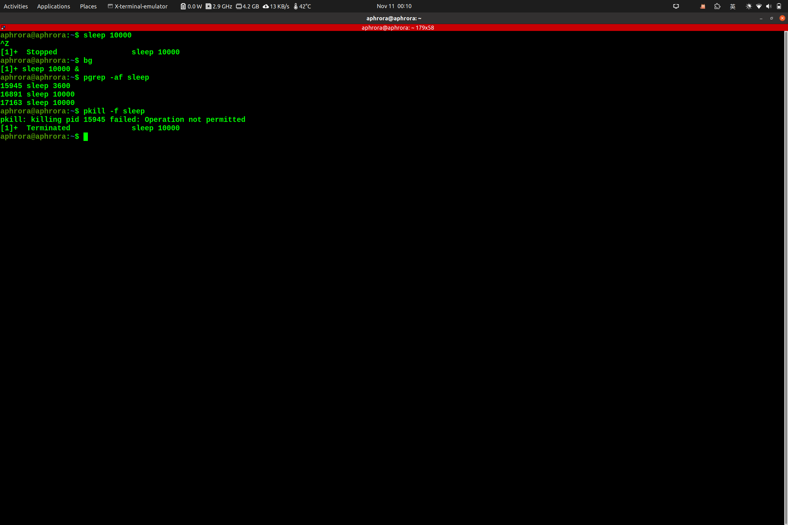

## 通识课程 第二科 作业补交

### 1．我们可以使用类似 ps aux | grep 这样的命令来获取任务的 pid ，然后您可以基于 pid 来结束这些进程。但我们其实有更好的方法来做这件事。在终端中执行 sleep 10000 这个任务。然后用 Ctrl - Z 将其切换到后台并使用 bg 来继续允许它。现在，使用 pgrep 来查找 pid 并使用 pkill 结束进程而不需要手动输入 pid 。（提示：使用- af 标记）。

### 2.创建一个 dc 别名,它的功能是当我们错误的将 cd 输入为 dc 时也能在正确运行

### 3．进行原地替换听上去很有诱惑力，例如：sed s/REGEX/SUBSTITUTION/input.txt > input.txt。

但是这并不是一个明智的做法，为什么呢？还是说只有 sed 是这样的？查看 man sed 来完成这个问题

==1.文件覆盖问题，若执行过程中因为正则表达式错误，内存不足或其他原因运行出错，则源文件的内容将会丢失。==
==2.原子性问题，覆盖操作的颗粒度不够精细，只有成功和失败两种结果，在多进程环境中可能面临文件内容不一致的结果==

==awk 默认情况下不会修改源文件，sed 可通过-i 参数实现较为安全的替换操作==

==例 sed -i.bak "s/terminated/killed/g" sleep.sh==

### 4．找出您最近十次开机的开机时间平均数、中位数和最长时间。在 Linux 上需要用到 journalctl。找到每次起到开始和结束时的时间戳。

### 5.附加题

